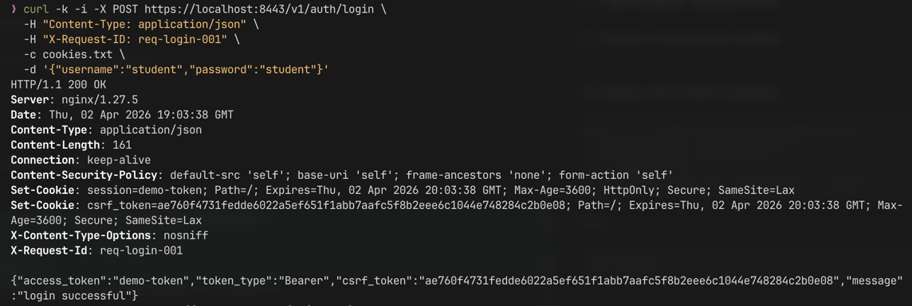
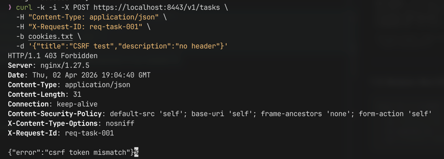
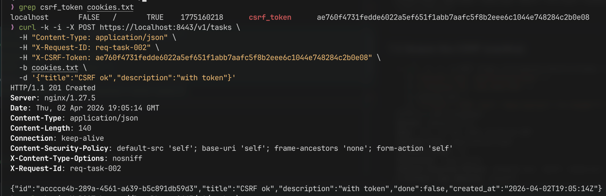
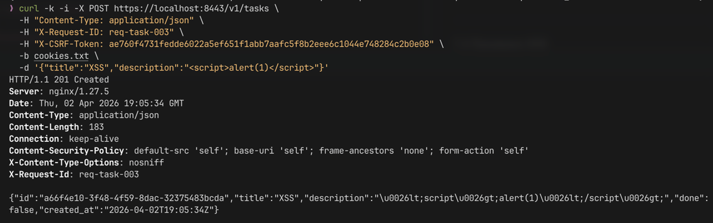

# Практическое занятие №6  
## Рузин Иван Александрович ЭФМО-01-25  
### Реализация защиты от CSRF/XSS. Работа с secure cookies  

---

## 1. Краткое описание

В рамках работы реализована защита backend-приложения от основных браузерных угроз:

- CSRF (Cross-Site Request Forgery)
- XSS (Cross-Site Scripting)

А также внедрена безопасная работа с cookies:

- использование HttpOnly, Secure, SameSite
- разделение session и csrf_token

Auth service отвечает за выдачу cookies,  
Tasks service — за проверку авторизации и CSRF.

---

## 2. Схема взаимодействия

```mermaid
sequenceDiagram
    participant C as Client
    participant N as Nginx (HTTPS)
    participant A as Auth service
    participant T as Tasks service

    C->>N: POST /v1/auth/login
    N->>A: login
    A-->>C: Set-Cookie (session, csrf_token)

    C->>N: POST /v1/tasks + cookies + X-CSRF-Token
    N->>T: request
    T->>A: gRPC Verify(session)
    A-->>T: valid / error
    T-->>C: 201 / 403 / 401
````

---

## 3. Реализация secure cookies

После успешного логина сервер устанавливает две cookies:

### 3.1 Session cookie

Используется для аутентификации.

Параметры:

* `HttpOnly` — запрещает доступ из JavaScript
* `Secure` — передается только по HTTPS
* `SameSite=Lax` — защита от кросс-сайтовых запросов
* `Path=/`
* `Max-Age=3600`

Пример:

```http
Set-Cookie: session=demo-token; Path=/; HttpOnly; Secure; SameSite=Lax
```

---

### 3.2 CSRF cookie

Используется для защиты от CSRF.

Параметры:

* `HttpOnly=false` — чтобы клиент мог прочитать
* `Secure`
* `SameSite=Lax`
* `Path=/`
* `Max-Age=3600`

```http
Set-Cookie: csrf_token=<random>; Path=/; Secure; SameSite=Lax
```

---

## 4. Реализация CSRF защиты

Использован подход **Double Submit Cookie**.

### 4.1 Принцип работы

1. Сервер выдает cookie `csrf_token`
2. Клиент читает значение cookie
3. Клиент отправляет заголовок:

   ```
   X-CSRF-Token: <value>
   ```
4. Сервер сравнивает:

    * значение cookie
    * значение заголовка

Если значения не совпадают → `403 Forbidden`

---

### 4.2 Где применяется защита

CSRF проверяется для методов:

* POST
* PATCH
* PUT
* DELETE

GET-запросы не проверяются.

---

### 4.3 Middleware логика

```text
если метод "опасный":
    если есть session cookie:
        взять csrf_token из cookie
        взять X-CSRF-Token из заголовка
        если отсутствует или не совпадает:
            вернуть 403
```

---

## 5. Проверка авторизации

Tasks service использует два варианта:

1. Cookie-based:

   ```
   Cookie: session=<token>
   ```

2. Bearer fallback:

   ```
   Authorization: Bearer <token>
   ```

Далее выполняется gRPC-запрос в Auth service:

```text
Verify(token) → valid / invalid
```

---

## 6. Защита от XSS

Реализованы базовые меры.

### 6.1 Санитизация данных

Поле `description` обрабатывается:

```go
html.EscapeString(value)
```

Пример:

```
<input>:  <script>alert(1)</script>
<output>: &lt;script&gt;alert(1)&lt;/script&gt;
```

Таким образом исключается выполнение JS.

---

### 6.2 Ограничение поведения браузера

Добавлены заголовки безопасности:

```http
Content-Security-Policy: default-src 'self'
X-Content-Type-Options: nosniff
```

---

## 7. Примеры запросов

### 7.1 Логин и получение cookies



---

### 7.2 Запрос без CSRF (ошибка)



---

### 7.3 Запрос с CSRF (успешно)



---

### 7.4 Проверка XSS



---

## 8. Инструкция по запуску

### 8.1 Требования

* Docker
* Docker Compose
* свободный порт 8443

---

### 8.2 Запуск

```bash
cd deploy/tls
docker compose up --build
```

---

### 8.3 Доступ

* Auth: [https://localhost:8443/v1/auth/](https://localhost:8443/v1/auth/)
* Tasks: [https://localhost:8443/v1/tasks](https://localhost:8443/v1/tasks)

---

## 9. Что было реализовано

* безопасные cookies (HttpOnly, Secure, SameSite)
* CSRF защита (double submit)
* проверка CSRF через middleware
* поддержка cookie-based авторизации
* базовая защита от XSS (escape)
* добавлены security headers
* проксирование через HTTPS (nginx)

---

## 10. Ответы на контрольные вопросы

**Почему CSRF возможен?**
Потому что браузер автоматически отправляет cookies, даже если запрос инициирован сторонним сайтом.

**Что делает SameSite?**
Ограничивает отправку cookies при кросс-сайтовых запросах (Lax, Strict, None).

**Зачем HttpOnly?**
Запрещает доступ к cookie из JS, снижая риск кражи при XSS.

**Почему Secure обязателен?**
Чтобы cookie не передавались по HTTP и не могли быть перехвачены.

**Как работает double-submit?**
Сравнивается токен из cookie и заголовка — злоумышленник не может подделать оба.

**Что такое XSS?**
Выполнение вредоносного JS через пользовательский ввод.

**Как защититься?**
Экранирование, санитизация, CSP и запрет выполнения небезопасного контента.